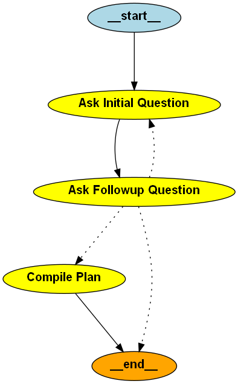

## 📚 Table of Contents

- [Project Structure](#project-structure)
- [Setup/Start Instructions](#setupstart-instructions)
- [Customizing Business Plan Sections](#🧩-customizing-business-plan-sections)
- [BusinessChatbotEngine Flow Overview](#📁-businesschatbotengine-flow-overview)
- [prompts.yaml Structure](#📁-promptsyaml-structure)
- [Adding/Removing Sections](#addingremoving-sections)
---

# 🧠 AI-Powered Business Plan Generator

This project is an AI chatbot that guides users step-by-step through creating a professional business plan. It uses [FastAPI](https://fastapi.tiangolo.com/) as the backend, uses [LangGraph](https://docs.langchain.com/langgraph/) + [LangChain](https://www.langchain.com/) to manage conversational flow, powered by the **LLaMA 3.1** language model via [Ollama](https://ollama.com/), and uses [Streamlit](https://streamlit.io/) as the frontend.


## Project Structure
<pre>
📁 BusinessFlow Chatbot/  
├── BusinessChatbotEngine.py      # Core logic for the conversational engine  
├── main.py                       # FastAPI backend server (defines /start and /step endpoints)  
├── prompts.yaml                  # All customizable prompts and business plan sections
├── streamlit_frontend.py         # Streamlit frontend for user interaction
├── requirements.txt              # All dependencies
├── charlotte_white_logo.png      # Logo shown in sidebar
└── README.md                     # This file
</pre>

---
# 🛠 Setup & Run Instructions

Install [Python 3.12.2](https://www.python.org/downloads/) and follow these steps to set up and run the application:

```bash
# 1. Navigate to the project directory
cd path/to/project-directory

# 2. Create and activate a virtual environment
python -m venv venv

# On Windows
venv\Scripts\activate

# On macOS/Linux
source venv/bin/activate

# 3. Install dependencies
pip install -r requirements.txt

# 4. Install Ollama (https://ollama.com/download)
# Follow instructions for your OS, then continue below once installed

# 5. Pull the LLaMA 3.1 model
ollama pull llama3.1

# 6. Start the FastAPI backend server
python -c "import uvicorn; uvicorn.run('main:app', host='0.0.0.0', port=8000, workers=1)"

# 7. In a new terminal, run the Streamlit frontend
streamlit run streamlit_frontend.py
```

### Things To Note

- Streamlit will open a browser. Start interacting with the front-end that will show in your browser.

- If you don't have a GPU on your device, the ChatBot will perform much slower.

- ctrl+c to shut down back end and front end in terminals.  

--- 
## 🤖 Agentic AI Behavior in the BusinessChatbotEngine

This application demonstrates **agentic AI** principles by enabling an autonomous, goal-directed dialogue system that builds a business plan through user interaction.

Key agentic behaviors include:

- **Goal-Oriented Flow Control**: The system progresses through multiple predefined sections of a business plan, gathering user input and determining what to ask next without manual intervention.

- **Context-Aware Adaptation**:
  - It dynamically generates **follow-up questions** using LLM responses based on the user's previous input.
  - If the user enters commands like `"back"`, `"skip"`, `"exit"`, or `"restart"`, the agent autonomously **changes the flow** - skipping sections, restarting, or exiting gracefully.

- **Memory and History Tracking**:
  - The system maintains a **history of Q&A** for each section, which it uses later to compile the final business plan.
  - Inputs are contextually processed and stored for use in the final compilation prompt.

- **Final Output Compilation**:
  - After collecting responses, the system autonomously constructs a comprehensive business plan using a large language model.
  - This step is triggered **without user instruction**, based on state conditions.

These behaviors allow the system to **act independently** and **adaptively**.

---
# 🧩 Customizing Business Plan Sections

Each section is an element in the business plan. It includes the question you specify and a followup question that will be generated by the AI to clarify the user's response.

You can add, remove, or reorder business plan sections by editing the `prompts.yaml` file. You can also modify the default prompts here.

The `prompts.yaml` has two categories for prompts. The first is 'default' which contains the default prompts. The next is 'customs' which overrides the 'default' prompts and can be set in the admin panel on the frontend.

## 📁 [BusinessChatbotEngine](./BusinessChatbotEngine.py) Flow Overview



1. **Ask Initial Question**  
   Here, the chatbot asks the user the initial question provided in the prompt from the sections in the `customs` category in `prompts.yaml`. It displays the prompt associated with the current section which is internally monitored.

2. **Ask Followup Question**  
   After getting the user's initial response, the chatbot asks a **custom-generated followup question** using a prompt template and the LLM. This question is generated based on the initial question asked and the user's response to it.
   The flow then branches based on conditions:
   - **Back to the previous section's Ask Initial Question** → if the user typed `back`
   - **To Compile Plan** → if all sections are complete
   - **To END** → if the user typed `exit`

3. **Compile Plan**  
   Once all Q&A is collected, the chatbot compiles everything into a structured business plan and ends the session.

Since the structure on the flow isn't hard coded, it is flexible to adding, removing, and modifying sections without touching python source code through `prompts.yaml`.

## 📁 [prompts.yaml](./prompts.yaml) Structure

This file controls how the chatbot interacts with users and generates business plans. It is divided into two main categories: `customs` and `defaults`.

### 🔹 `customs`

These are the **active prompts** used by the chatbot during a session.

- **`compile_plan_prompt`**  
  A template used at the end of the session to generate a full business plan. It receives all questions asked by the LLM and all answers that users provided in response via `{all_qa}` and formats the output using a structured outline.

- **`followup_prompt`**  
  A prompt that analyzes the user’s response to a question and creates a followup question or asks for clarification if information is missing. It receives the initial question asked at `{question}` and receives the user's response to that question with `{response}`.  

- **`sections`**  
  A list of individual business plan sections. Each entry includes:
  - `name`: The section title (e.g., "Market Analysis").
  - `prompt`: The initial question asked to the user to collect input for that section.

### 🔹 `defaults`

These store the original versions of all prompts, used to support the Admin Panel’s reset functionality.

Everything in customs should have a matching entry in defaults, including:
- *compile_plan_prompt*
- *followup_prompt*
- all *sections*  


## Adding/Removing Sections

1. Open `prompts.yaml`.
2. Locate both the `customs:` and `defaults:` category and make the following changes to both.
3. Under each category, find the `sections:` list and **remove an entry** or **add a new entry** like this:

```yaml
- name: Risk Assessment
  prompt: What are the biggest risks your business might face, and how will you mitigate them?
```

Once again, please remember that the structures for `customs:` and `defaults:` category must match even if they have differing content. 

